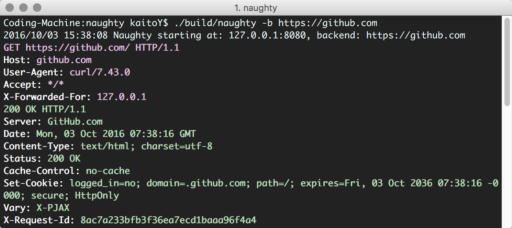

# naughty
Naughty is a tool acting as a man-in-the-middle reverse proxy server pretty printing http request/response for debug purposes

###Build:

	make build

###Usage:

	  -a string
	    	local addr to bind (default "127.0.0.1:8080")
	  -b string
	    	backend server url, e.g http://test.com
	  -body
	    	print body content